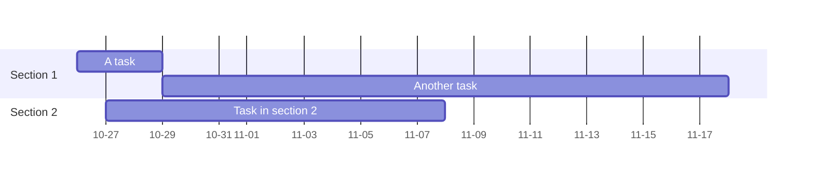

Markdown 本身沒有內建甘特圖的語法。你需要使用第三方擴展或工具來在 Markdown 中呈現甘特圖。以下是一些常用的方法：

**1. 使用 Mermaid.js:**

Mermaid.js 是一個用於生成圖表和流程圖的 JavaScript 库，可以直接在 Markdown 中使用。它支援甘特圖，而且許多 Markdown 編輯器和渲染器都支援它。



這段程式碼會產生一個簡單的甘特圖。你需要在你的 Markdown 檔案中加上 ````mermaid` 和 ````` 來包含 Mermaid 程式碼。

* `dateFormat`: 指定日期格式。
* `axisFormat`: 指定軸上的日期格式。
* `section`: 定義區段。
* `task name :a1, start_date, duration`: 定義任務，`a1` 是任務 ID (可選，用於建立依賴關係)，`start_date` 是開始日期，`duration` 是持續時間 (例如 `3d` 表示 3 天)。
* `:after a1`: 表示此任務在任務 `a1` 之後開始。


**2. 使用 PlantUML:**

PlantUML 是一個繪圖工具，也支援甘特圖。與 Mermaid 類似，你需要一個支援 PlantUML 的 Markdown 編輯器或渲染器。

```plantuml
@startgantt
Project A starts 2023-10-26
[Task 1] lasts 3 days
[Task 2] lasts 5 days and starts after [Task 1] is finished
[Task 3] lasts 2 days and starts after [Task 2] is finished

@endgantt
```

這段程式碼需要 PlantUML 渲染器才能正確顯示。


**3. 使用外部工具生成甘特圖，然後將圖片嵌入 Markdown:**

你可以使用 Microsoft Project, LibreOffice Calc, Google Sheets 等工具建立甘特圖，然後將其儲存為圖片 (例如 PNG 或 SVG)，最後使用 Markdown 的圖片語法將圖片嵌入到你的文件中。

```markdown

```

這方法最簡單直接，但缺點是甘特圖不是動態生成的，修改甘特圖需要重新生成圖片。


**選擇哪種方法取決於你的需求和環境:**

* **Mermaid.js:** 最方便，因為它直接在 Markdown 中定義，許多工具支援它，且相對容易學習。
* **PlantUML:** 功能更強大，但學習曲線略陡峭，且需要額外的設定。
* **外部工具:** 最簡單直接，但缺乏靈活性。


記住，你需要一個支援你所選擇的甘特圖生成方法的 Markdown 編輯器或渲染器。  例如，GitHub、GitLab 等平台支援 Mermaid.js。  如果你使用的是本地 Markdown 編輯器，你需要安裝必要的插件或擴展。
WARNING: All log messages before absl::InitializeLog() is called are written to STDERR
E0000 00:00:1738207889.702589 108203302 init.cc:232] grpc_wait_for_shutdown_with_timeout() timed out.
